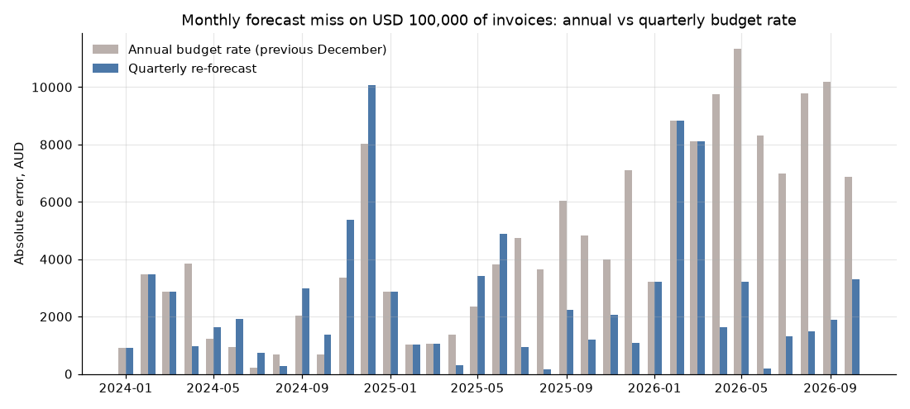

# FX Rates Pipeline: AUD exchange-rate ETL

[](https://github.com/nisha1324/fx-rates-pipeline/actions/workflows/daily.yml)

**TL;DR.** A self-updating ETL pulls ECB exchange rates daily via GitHub Actions into SQLite, and five SQL queries turn them into an FX-exposure report for an Australian importer. As of 2026-09-30, AUD had gained 23.0% against JPY but lost 7.1% against GBP since January 2023. On USD 100k a month of invoices, a "set it in December" budget rate missed by **22.8k to 76.5k AUD a year**. Re-forecasting each quarter would have cut the average monthly miss by **43%** (4,474 → 2,534 AUD).

## Why
An Australian business that buys from suppliers in the US, China or Europe, or bills clients in India or Singapore, carries **currency risk**. A 5% move in AUD/USD changes the landed cost of every US invoice by 5%. Finance teams need a reliable, always-current rate history to price quotes, set budget rates and see how much they are exposed.

This project builds that history as a small, production-style **data pipeline**: extract → validate → load. It is designed to run unattended every day.

## Data
- **Source:** [Frankfurter API](https://frankfurter.dev). It is free, needs no API key and serves the **European Central Bank** daily reference rates (business days only).
- **Scope:** base currency **AUD**, quoted against USD, EUR, GBP, CNY, INR, JPY, NZD and SGD, from 2023-01-01 onward.
- **Store:** `data/fx_rates.db`, about 0.5 MB of SQLite. It grows by 8 rows each business day. At the 2026-09-30 snapshot it held 7,656 rows (957 business days × 8 currencies) from 2023-01-02.

## Pipeline design
```
Frankfurter API ──► extract.py ──► transform.py ──► load.py ──► data/fx_rates.db
  (JSON, ECB)       retries +       flatten to        idempotent      fx_rates
                    backoff         tidy rows +       upsert on       pipeline_runs
                                    validation        (date,base,quote)
```
| Concern | How it's handled |
|---|---|
| **Incremental loads** | Each run asks for data only after the latest stored date. On an empty DB it backfills from `START_DATE`. |
| **Idempotency** | The primary key is `(date, base, quote)` with `ON CONFLICT DO UPDATE`, so a rerun adds 0 rows. |
| **Data quality** | Before loading, the run fails loudly on nulls, non-positive rates, duplicate keys or malformed dates. |
| **API quirks** | Frankfurter moves a range start back to the previous business day, so those rows are dropped to keep loads strictly incremental. |
| **Auditability** | Each run writes a row to `pipeline_runs` with the timestamp, requested start, rows fetched, rows new and latest date. |
| **Transient failures** | 3 attempts with exponential backoff. |

## Report: what the rates say (snapshot: data to 2026-09-30)
`python -m report.build` runs the five queries in [`sql/`](sql/) against the store and writes [`results/REPORT.md`](results/REPORT.md) plus the charts below. The daily Action regenerates the report and charts, so they move a little each day. The figures quoted in this section are a fixed snapshot as of 2026-09-30.

**1. AUD strength** (`sql/01_aud_strength.sql`). Since 2023-01-02, AUD buys **23.0% more JPY**, 18.5% more INR, 14.8% more NZD and 2.4% more USD. It buys **7.1% less GBP**, 3.7% less EUR and 2.5% less SGD, so UK and European suppliers now cost more in AUD. Japanese and Indian suppliers cost less.


**2. Volatility** (`sql/02_volatility.sql`, stdev of daily log returns × √252). AUD/JPY is the most volatile pair (11.5% a year, worst day −5.65%), then AUD/USD (9.7%). AUD/NZD is the calmest (4.7%). A 10% annual swing on a large USD payables book is a real budget risk.


**3. Budget-rate variance for a USD importer** (`sql/03_budget_variance.sql`). This assumes USD 100,000 of supplier invoices a month and a budget rate set at the previous December's average AUD/USD (an illustrative policy, not real company data).

| Year | Budget rate | Avg actual | Variance (AUD) |
|---|---|---|---|
| 2024 | 0.6681 | 0.6599 | **−22,806** (over budget) |
| 2025 | 0.6341 | 0.6446 | +30,225 |
| 2026 (Jan–Sep) | 0.6640 | 0.7039 | +76,533 |

The swing between single months ran from −8,032 AUD (Dec 2024) to +11,328 AUD (May 2026). September 2026 runs to the 30th.


**4. Annual vs quarterly budget rate** (`sql/05_budget_policy.sql`). This tests the obvious fix: reset the budget rate every quarter to the previous month's average (Dec for Q1, Mar for Q2, Jun for Q3, Sep for Q4) instead of once a year. Each policy is scored on its absolute monthly miss on USD 100k of invoices (Jan 2024 – Sep 2026, 33 months).

| Year | Annual policy, total miss | Quarterly policy, total miss |
|---|---|---|
| 2024 | 28,236 AUD | 32,572 AUD (worse) |
| 2025 | 42,857 AUD | 21,199 AUD |
| 2026 (Jan–Sep) | 76,533 AUD | 29,863 AUD |
| **Mean per month** | **4,474 AUD** | **2,534 AUD (−43%)** |

Quarterly re-forecasting helps most when AUD trends steadily (2025–26). It is *not* always better: in late 2024 AUD fell sharply right after the September reset, and the Q4 rate missed by 10,073 AUD in December. A more frequent forecast cuts the error, but it doesn't remove the risk.



**So what for the business?** Even a simple budget-rate policy is off by tens of thousands of AUD a year on a modest USD spend, and the error changes sign from year to year. That argues for (a) re-forecasting the budget rate quarterly rather than annually, (b) hedging a share of committed USD and JPY payables, where volatility is highest, and (c) reviewing GBP/EUR supplier pricing, since AUD has weakened against both.

## How to run
```bash
python -m venv .venv && source .venv/bin/activate
pip install -r requirements.txt
python -m pipeline.run     # backfill on first run, then incremental
python -m report.build     # SQL report -> results/REPORT.md + charts
pytest -q                  # offline tests (no network)
```
Output from a real first run and an immediate rerun:
```
from 2023-01-01: fetched 7640 rows, 7640 new; table now 7640 rows, latest 2026-09-28
from 2026-09-29: fetched 0 rows, 0 new; table now 7640 rows, latest 2026-09-28
```

## Automation (GitHub Actions)
[`.github/workflows/daily.yml`](.github/workflows/daily.yml) runs at **16:30 UTC on weekdays**, after the ECB publishes its rates around 16:00 CET. It can also be started by hand (`workflow_dispatch`). Each run:
1. installs dependencies and runs the offline test suite, so a broken change never touches the data;
2. runs `python -m pipeline.run` (incremental, so on a quiet day it adds 0 rows);
3. rebuilds the report and charts;
4. commits `data/` and `results/` **only if they changed**, as `data: daily FX refresh through <latest date>`.

Runner SQLite builds don't always include the `LN`/`SQRT` math functions that the volatility query needs, so `report/build.py` registers Python fallbacks when they're missing (tested in `tests/test_report_sql.py`). The first manual run on 2026-10-01 loaded 16 new rows (2026-09-29 and 2026-09-30) and committed the refresh itself.

**So what for the business?** Finance gets a rate history and an exposure report that update themselves, with no server to run and no cost, since a public repo gets free Actions minutes. Every refresh is versioned in git, so you can always see which rates a past quote or budget was based on.

## Recommendations
Each one is tied to a measured figure above. The numbers come from the 2026-09-30 snapshot.

| # | Recommendation | Evidence | Owner |
|---|---|---|---|
| 1 | **Re-forecast the USD budget rate quarterly**, not annually | Mean monthly miss falls from 4,474 to 2,534 AUD (−43%); the annual miss reached 76.5k AUD in Jan–Sep 2026 | FP&A |
| 2 | **Hedge part of committed USD/JPY payables** (e.g. forwards on 50% of the next quarter) | Re-forecasting alone still missed by 10k AUD in a single month (Dec 2024); JPY 11.5% and USD 9.7% annual volatility are the highest pairs | Treasury / CFO |
| 3 | **Renegotiate or reprice GBP- and EUR-denominated supplier contracts** | AUD −7.1% vs GBP and −3.7% vs EUR since Jan 2023, so those costs rose with no change in supplier price | Procurement |
| 4 | **Consider shifting sourcing toward JPY/INR-priced suppliers** where quality allows | AUD +23.0% vs JPY and +18.5% vs INR | Procurement |
| 5 | **Quote NZD clients with thinner FX buffers** than USD/JPY clients | AUD/NZD is the calmest pair (4.7% a year, worst day −1.22%) | Sales / Finance |
| 6 | **Use the git history of `data/` as the audit trail** for which rate a quote or budget used | Every daily refresh is a dated commit | Finance ops |

## Limitations
- ECB **reference** rates are mid-market fixes at about 16:00 CET. Bank or payment-provider rates include a spread, so real costs are slightly higher.
- The importer (USD 100k a month, flat) is illustrative, not real company data. Real payables are lumpy and often already partly hedged.
- Monthly **average** rates are used. A business paying on specific dates will see different numbers.
- History starts in January 2023, which covers only about three budget cycles. Treat the −43% as directional, not as a guarantee.
- The live `results/REPORT.md` includes the current partial month, so its numbers drift from the snapshot quoted here.

## Roadmap
- [x] Extract / transform / validate / load with an audit log and tests
- [x] SQL + chart report: AUD strength by currency, volatility, budget-rate variance for an importer
- [x] GitHub Actions: scheduled daily run that commits new rates and refreshes the report
- [x] Business findings and recommendations (annual vs quarterly budget-rate test)
